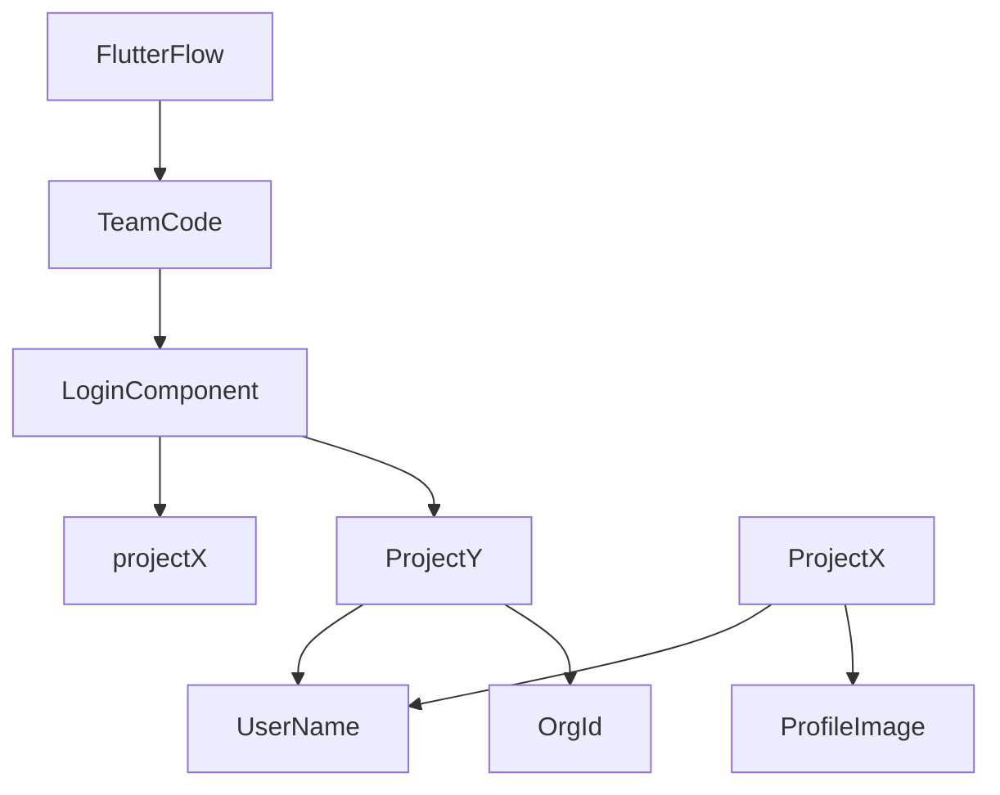

# Official Dowell-Mobile-Login-Component Documentation
         flutterflow component of login

## Understanding how Login Component works
We value our devs , so to save their time, we developed Login component in flutterflow, which means we can use it every 
FF project, without creating api calls, and updating AppState each time.

### App State
As mentioned earlier, The Login Component stores user information in you project's appstate, so developer dont have to call login api's
and update the app state.

Please note that in your project their will be two variables already stored in it. 1 response, 2 sessionId

* response (Json)
  - after login user's information will be stored in this variable. you can access userinfo, portfolio info, org info, selected workspaces and its id.
+ sessionId (String)
  - after login user's session id will be stored in this variable. you can use this for handeling user logs.

### Accessing Basic User information through Json Path
First select the response variable to access the data and then select json path as value, then you can give a specific
json path to retrieve your needed value.

> Basic Info

| Value | Json Path |
| --- | --- |
| ` user name ` | $.userinfo.username |
| `first name` | $.userinfo.first_name |
| `email` | $.userinfo.email |
| `profile image` | $.userinfo.profileImage |
| `phone` | $.userinfo.phone |

> Id's

| Value | Json Path |
| --- | --- |
| `session id` | call session id variable |
| `user id` | $.userinfo.userId |
| `client admin id` | $.userinfo.client_admin_id |

> Other data

| Value | Json Path |
| --- | --- |
| `portfolios with their details` | $.portfolio_info |
| `other orgs with their details` | $.other_org |
| `other orgs with their name and id` | $.otherorg_list |

### Handeling Login State
